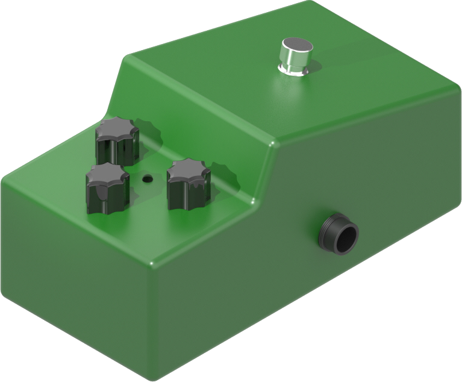

<h1 align="center">
	<br>
		
	<br>
		TS741
	<br>
</h1>

<h4 align="center">A PoliTeK reproduction of the <a href="https://www.ibanez.com/eu/products/detail/ts9_99.html">Ibanez TS9</a>.</h4>

---

<p align="center">
	<a href="#key-features">Key Features</a> •
	<a href="#how-to-use">How To Use</a> •
	<a href="#credits">Credits</a> •
	<a href="#license">License</a>
</p>

## Key Features

- **5 different clipping modes** using different diodes.
- **More bass mod**: boosted low frequences under 700Hz.
- **Tone mod**: wider frequency response, making the pedal more versatile for other instruments like synths.
- **9V Battery slot**, automatically unplugged when using cable power.
- **True Bypass** to deflect the signal directly from input to output when the effect is disabled.

## How To Use

To simulate the behaviour of the PCB we designed, we used LTspice ([download here](https://www.analog.com/en/resources/design-tools-and-calculators/ltspice-simulator.html)).

### LTspice Setup

For the simulation we used an op-amp TL042 model which is not included in LTspice's internal library, so you have to manually import the files `TL072.asy` and `TL072.sub` which you can find inside the `Simulation` folder of this repo.

To find LTspice’s component folder on your computer:
- Open any schematic in LTspice.
- Open the components window.
- Under `Top Directory:`, you will see the path to the LTspice's internal library folder:
    - On Windows, it should be something like: `C:\users\<username>\AppData\Local\LTspice\lib\sym`.
    - On Linux, using Wine, the folder `C:\users\<username>\AppData\Local\LTspice\lib\sym` corresponds to `~/.wine/drive_c/users/<username>/AppData/Local/LTspice/lib/sym`.
- Move the files:
    - `TL072.asy` to the folder `C:\...\LTspice\lib\sym\OpAmps`.
    - `TL072.sub` to the folder `C:\...\LTspice\lib\sub`.
- After moving the two files, restart LTspice.

### Running a simulation with an external audio

- Inside the `Simulation` folder you can already find a `test.wav` audio file for simulation
- Alternatively, if you want to run a simulation with your own audio file:
    - Convert your audio file to `.wav` format (you can use this [online converter](https://online-audio-converter.com/it/)).
    - Rename your audio file to `test.wav` and place it in the same folder as the simulation file `TS741.asc`.
- Run the simulation and set the duration with the command `.tran <time_in_seconds>`.
- After the simulation, an `output.wav` file will be generated in the same folder as `TS741.asc`, containing the distorted input audio (you can convert it to `.mp3` using the same [online converter](https://online-audio-converter.com/it/)).

### Modifications needed for audio file simulation

To set an audio file as input, set the `value` of the `V2` input generator inside to `WAVEFILE=<filename>.wav` (e.g., `WAVEFILE=test.wav`). To modify the value, press `Ctrl + Right Click` on the `V2` generator.
Spice will search for the file in the same folder as `TS741.asc`.
To generate an output file, use the command `.wave <filename>.wav 16 44.1k V(<output_node>)` (for more details on this command, check [this link](https://spiceman.net/ltspice-command-wave/#index_id1)).

### Troubleshooting for `Bad wave file format found in test.wav` error

Check [this Reddit thread](https://www.reddit.com/r/diypedals/comments/oozekw/ltspice_wav_file_input/).

### Simulating potentiometers inside LTspice

A linear potentiometer can be represented in SPICE using two resistors, `Tone1` and `Tone2`, with values of $m * R_{max}$ and $(1 - m) * R_{max}$, where:
- $R_{max}$ is the potentiometer’s maximum resistance.
- $m$ is a parameter ranging from $0$ to $1$ that indicates the potentiometer’s position.

To set these values in the `Tone1` and `Tone2` resistors, press `Ctrl + Right Click` on the resistor and enter the formula in curly brackets.

The `.param` command allows you to define a parameter value:

```
.param <parameter_name> = <parameter_value>
```

A logarithmic potentiometer is represented by two resistors with values $R_{tot} * (1 - m^k)$ and $R_{tot} * m^k$.

> Note: the exponentiation operator in LTspice is `**`, not `^`.

To run a simulation that varies a parameter and observe its effect on circuit quantities ($V$ and $I$), use the `.step` param command:

```
.step param <parameter_name> <min_value> <max_value> <increment>
```

### About the minimum resistance $R_{min}$

Ideally, the parameter $m$ should vary from $0$ (fully closed potentiometer) to $1$ (fully open potentiometer), but LTspice does not accept zero resistance values. This causes an error when calculating $R$ for $m = 0$ and $m = 1$. To avoid this, a very small $R_{min}$ (`1m`, i.e., $10^{-3}$) is added to the resistance values.

## Credits

For this project, we used the [Tube Screamer Analysis made by Electrosmash](https://electrosmash.com/tube-screamer-analysis).

## License

[MIT](https://choosealicense.com/licenses/mit/)

---

<p align="center">
	<a href="mailto:info.politek23@gmail.com">E-Mail</a> •
	<a href="https://www.instagram.com/politek_music">Instagram</a> •
	<a href="https://t.me/+dLKMAwzNmQYxNzM0">Telegram Community</a>
</p>